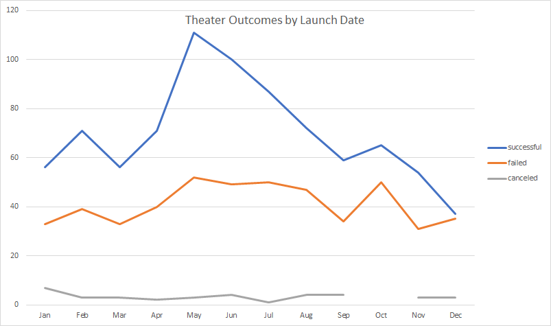
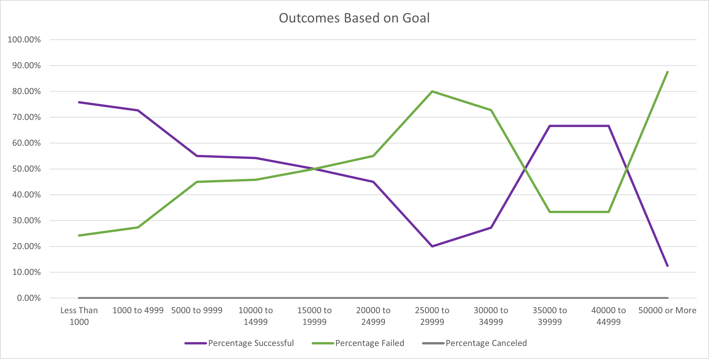

# Kickstarting with Excel

## Overview of Project

### Purpose

This report is to analyze the outcomes of theater Kickstarter campaigns based on launch date or funding goal.

## Analysis and Challenges

### Analysis of Outcomes Based on Launch Date

### Analysis of Outcomes Based on Goals

## Results

- What are two conclusions you can draw about the Outcomes based on Launch Date?

There is a trimodal distribution in the data: Feb, May, and Oct proved to be popular months to launch theater campaigns. Of these three modes, May had a higher ratio of successful/failed campaigns, while Oct had the lowest. This implies that May is the best month to launch a theater Kickstarter, and Oct is the worst month.

- What can you conclude about the Outcomes based on Goals?

Campaigns with higher goals were more likely to fail, except over $30,000, where there was a positively correlated relationship, with a maximum centered around $40,000. This implies that a kickstarter with a goal of $20,000 might be better off asking for twice as much.

- What are some limitations of this dataset?

The only statistic relating to social engagement is number of backers. Times campaign page viewed or linked from facebook, etc would have offered another dimension of insight.

- What are some other possible tables and/or graphs that we could create?

A stacked chart would better show ratios between successful and failed campaigns, and the ratio between each and the whole. 